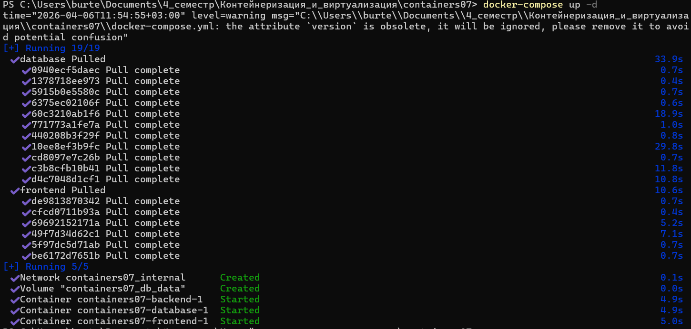
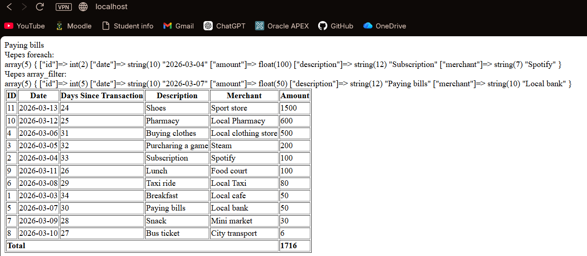

# IWNO №7: Создание многоконтейнерного приложения

## Цель работы

Ознакомиться с работой многоконтейнерного приложения на базе `docker-compose`.

## Задание

Создать PHP-приложение на базе трех контейнеров: `nginx`, `php-fpm`, `mariadb/mysql`, используя `docker-compose`.

## Подготовка

Для выполнения лабораторной работы на компьютере должен быть установлен Docker. Работа выполнялась на основе предыдущей лабораторной работы №6, в которой уже был подготовлен сайт на PHP.

## Ход выполнения работы

### 1. Подготовка структуры проекта

Был создан проект `containers07`. Внутри проекта подготовлена директория `mounts/site`, в которую был помещен PHP-сайт, созданный ранее.

### 2. Настройка файла `.gitignore`

В корне проекта создан файл `.gitignore`, чтобы не добавлять содержимое сайта:

```
# Ignore files and directories
mounts/site/*
```

### 3. Настройка Nginx

В директории `nginx` создан файл `default.conf` со следующей конфигурацией:

```
server {
    listen 80;
    server_name _;
    root /var/www/html;
    index index.php;

    location / {
        try_files $uri $uri/ /index.php?$args;
    }

    location ~ \.php$ {
        fastcgi_pass backend:9000;
        fastcgi_index index.php;
        fastcgi_param SCRIPT_FILENAME $document_root$fastcgi_script_name;
        include fastcgi_params;
    }
}
```

Данная конфигурация выполняет следующие функции:

* принимает HTTP-запросы на 80 порту
* использует каталог `/var/www/html` как корень сайта
* при обращении к PHP-файлам передает выполнение в контейнер `backend` по протоколу FastCGI
* если файл или директория не найдены, запрос перенаправляется в `index.php`

### 4. Настройка переменных окружения для базы данных

В корне проекта создан файл `mysql.env`:

```
MYSQL_ROOT_PASSWORD=secret
MYSQL_DATABASE=app
MYSQL_USER=user
MYSQL_PASSWORD=secret
```

Этот файл используется для передачи параметров инициализации контейнеру базы данных.

### 5. Создание файла `docker-compose.yml`

В корне проекта создан файл `docker-compose.yml`:

```
version: '3.9'

services:
  frontend:
    image: nginx:1.19
    volumes:
      - ./mounts/site:/var/www/html
      - ./nginx/default.conf:/etc/nginx/conf.d/default.conf
    ports:
      - "80:80"
    networks:
      - internal

  backend:
    image: php:7.4-fpm
    volumes:
      - ./mounts/site:/var/www/html
    networks:
      - internal
    env_file:
      - mysql.env

  database:
    image: mysql:8.0
    env_file:
      - mysql.env
    networks:
      - internal
    volumes:
      - db_data:/var/lib/mysql

networks:
  internal: {}

volumes:
  db_data: {}
```

### 6. Назначение контейнеров

В проекте используются три контейнера:

* **frontend** - контейнер на базе `nginx:1.19`, который принимает HTTP-запросы от пользователя
* **backend** - контейнер на базе `php:7.4-fpm`, который обрабатывает PHP-скрипты
* **database** - контейнер на базе `mysql:8.0`, который хранит данные приложения

Все контейнеры подключены к внутренней сети `internal`, благодаря чему они могут взаимодействовать друг с другом по именам сервисов.

### 7. Запуск многоконтейнерного приложения

Для запуска приложения использовалась команда:

```
docker-compose up -d
```



В результате Docker Compose:

1. скачал необходимые образы
2. создал сеть проекта `containers07_internal`
3. создал том `containers07_db_data`
4. создал и запустил контейнеры приложения

Также были автоматически созданы:

* сеть `containers07_internal`
* том `containers07_db_data`

### 8. Проверка работы приложения

После запуска контейнеров сайт был открыт в браузере по адресу `http://localhost`. 



Приложение успешно отобразило PHP-страницу со списком транзакций, фильтрацией записей и итоговой суммой. Это подтверждает, что:

## Ответы на контрольные вопросы

### 1. В каком порядке запускаются контейнеры?

Сначала Docker Compose создает служебные ресурсы проекта: сеть и тома. Затем запускаются контейнеры сервисов.

Явный порядок запуска между `frontend`, `backend` и `database` не задан, потому что в `docker-compose.yml` отсутствует директива `depends_on`. То есть, Compose создает и запускает контейнеры без строгой гарантии очередности готовности сервисов. На практике в ходе выполнения были запущены контейнеры:

1. `containers07-backend-1`
2. `containers07-database-1`
3. `containers07-frontend-1`

### 2. Где хранятся данные базы данных?

Данные базы данных хранятся в именованном Docker-томе `db_data`, который подключен к контейнеру `database` в каталог:

```
/var/lib/mysql
```

### 3. Как называются контейнеры проекта?

Контейнеры проекта имеют следующие имена:

* `containers07-frontend-1`
* `containers07-backend-1`
* `containers07-database-1`

### 4. Как добавить файл `app.env` с переменной окружения `APP_VERSION` для сервисов `backend` и `frontend`?

Для этого необходимо:

1. создать в корне проекта файл `app.env`
2. записать в него переменную окружения
3. подключить файл в секции `env_file` для нужных сервисов

После этого переменная `APP_VERSION` будет доступна внутри контейнеров `frontend` и `backend`.

## Вывод

В ходе выполнения лабораторной работы было создано многоконтейнерное приложение с использованием `docker-compose`. Приложение состоит из трех сервисов: веб-сервера `nginx`, интерпретатора `php-fpm` и базы данных `mysql`. Была настроена общая сеть контейнеров, подключены тома для сайта и хранения данных базы, а также вынесены параметры окружения в отдельный файл.

В результате работы было подтверждено, что Docker Compose упрощает развертывание взаимосвязанных сервисов и позволяет описать инфраструктуру приложения в одном конфигурационном файле. 

## Библиография

1. [Продвинутое конфигурирование Docker Compose](https://habr.com/ru/companies/otus/articles/337688/)
2. [Курс на "Moodle": "Контейнеризация и Виртуализация"](https://elearning.usm.md/course/view.php?id=6806)
3. [Переменные окружения для начинающих разработчиков или использование .env файла в разработке программного обеспечения](https://habr.com/ru/companies/gnivc/articles/792082/)